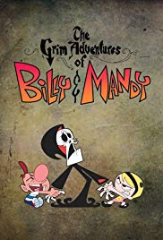
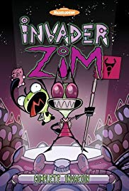
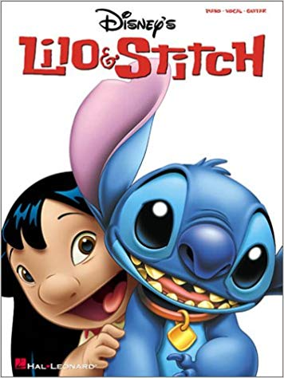
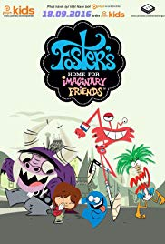

<h1> Project-6</h1>

My project is about my top 5 favorite cartoons from when I was a kid From each major channel cartoon network, Nickoloadean, and Disney channel. I will only use shows from the 2000's that I have seen and this is just my opinon about the show.

<h2 Cartoon Network</h2>
<ul>
 <li> The Grim Adventures Of Billy and Mandy</li>
 <li>Foster's Home for Imaginary Friends</li>
 <li>CodeName: KidsNextDoor</li>
 <li>Ed Edd n'Eddy</li>
 <li>Chowder</li>
</ul>  

<h3>Disney Channel</h3>
<ul>
<li>Lilo & Stitch</li>
<li>Recess</li>
<li>Proud Familiy</li>
<li>Kid vs Kat</li>
<li>American Dragon: Jake Long</li> 
</ul>

<Nickoloadean**
* *Invader Zim*
* *Avatar: The Last Airbender*
* *Rugrats*
* *ChalkZone*
* *Fairly Odd Parents*

# My Top 5 From All Networks
1.**The Grim Adventures Of Billy and Mandy**

https://www.imdb.com/title/tt0292800/

2.**Invader Zim**

[https://www.imdb.com/title/tt0235923/]

3.**Avatar: The Last Airbender**

[https://www.imdb.com/title/tt0417299/]

4.**Lilo & Stitch**

[https://www.imdb.com/title/tt0364774/]

5.**Foster's Home for Imaginary Friends**

[https://www.imdb.com/title/tt0419326/]

